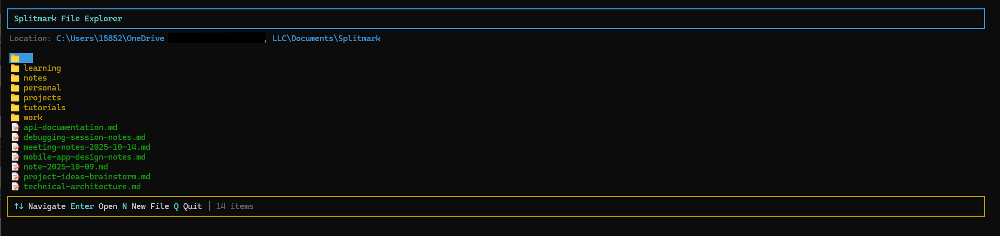
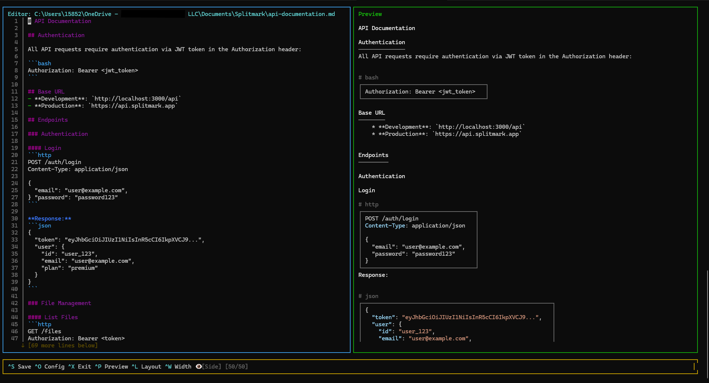
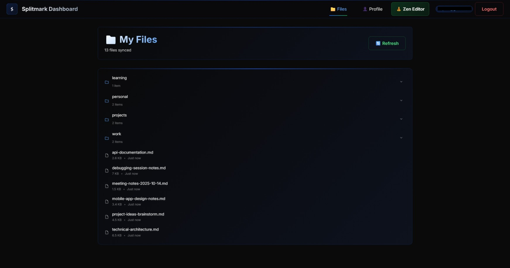
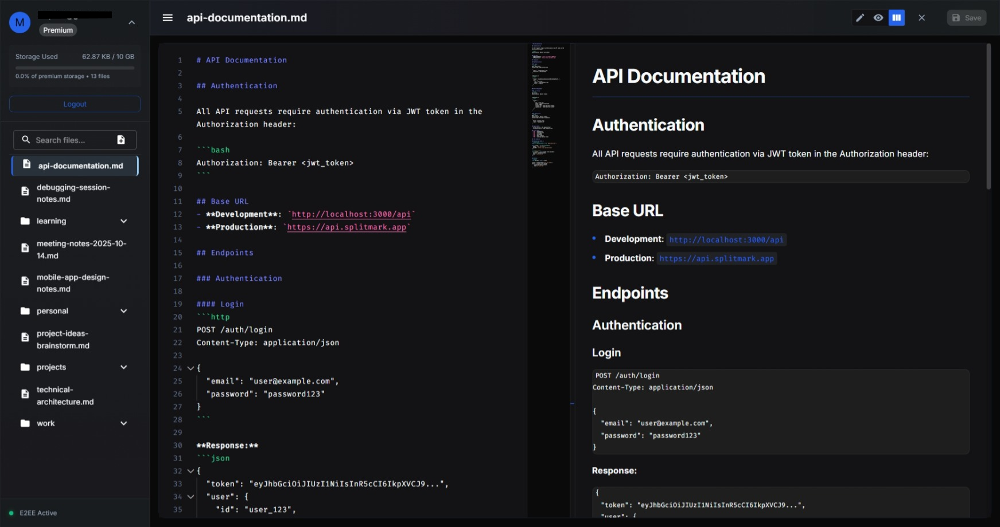

# Splitmark

[](https://www.npmjs.com/package/splitmark)
[](https://opensource.org/licenses/MIT)
[](https://nodejs.org)
[](https://github.com/splitmark/splitmark/actions)
[](https://codecov.io/gh/splitmark/splitmark)
[](CONTRIBUTING.md)

A lightweight CLI Markdown editor with live preview.

## Description

Splitmark is a terminal-based text editor specifically designed for editing Markdown files. It provides a split-view interface where you can edit your Markdown content on one side (or top) and see a live preview of the rendered output on the other side (or bottom). Perfect for quick edits, note-taking, documentation, or any Markdown workflow in the terminal.

**Key highlights:**

- 🎨 **Split-view preview** - Edit and preview side-by-side or stacked (configurable)
- ⌨️ **Intuitive controls** - Familiar keyboard shortcuts for editing, saving, and navigation
- ⚡ **Live rendering** - Instant Markdown preview with syntax highlighting
- 📁 **File explorer** - Browse and open files when launched without arguments
- 🎯 **Smart file management** - Configurable default location with automatic folder creation
- 🎨 **Syntax highlighting** - Color-coded Markdown elements in the editor
- 💾 **Configuration system** - Customize defaults via `~/.splitmarkrc`
- ☁️ **Cloud sync (optional)** - Sync files across devices with end-to-end encryption

## Screenshots

### CLI File Explorer


_Browse and select files directly from the terminal_

### CLI Editor with Live Preview


_Split-view editing with real-time markdown preview_

### Splitmark Cloud - File Management


_Manage your files across devices with cloud sync_

### Web Zen Editor


_Distraction-free web editing with the same files from your CLI_

## Features

### Editing

- **Full text editing** with cursor navigation
- **Syntax highlighting** for Markdown (headers, bold, italic, code, links, lists)
- **Text selection** with Shift+Arrow keys
- **Undo/Redo** (Ctrl+Z/Ctrl+Y)
- **Auto-formatting** (Ctrl+Shift+F) for clean Markdown structure
- **Smart indentation** (Tab/Shift+Tab)
- **Word jumping** (Ctrl+Arrow keys)
- **Line operations** (join lines with backspace at start)

### Preview

- **Live rendering** with [marked](https://marked.js.org/) and [marked-terminal](https://github.com/mikaelbr/marked-terminal)
- **Synchronized scrolling** - Preview follows cursor position
- **Toggle visibility** (Ctrl+P)
- **Layout switching** - Side-by-side ↔ Stacked (Ctrl+L)
- **Adjustable width** - Cycle through 75/25, 50/50, 25/75 ratios (Ctrl+W)

### File Management

- **File explorer** - Opens when no file specified
- **Smart path resolution**:
  - Simple filenames use default location (`~/Documents/Splitmark`)
  - Nested paths auto-create folders
  - Relative paths (`./` or `../`) use current directory
  - Absolute paths work as expected
- **Config file editing** - Open and edit `~/.splitmarkrc` with Ctrl+O

### Cloud Sync (Optional)

- **End-to-end encryption** - Files encrypted before upload
- **Cross-device sync** - Keep files in sync across multiple computers
- **Conflict detection** - Alerts when files change in multiple places
- **Secure authentication** - JWT-based auth with encrypted credential storage
- **100% optional** - Works perfectly without cloud features

See [CLOUD.md](CLOUD.md) for complete cloud sync documentation.

### Navigation

- **Arrow keys** - Move cursor up/down/left/right
- **Ctrl+Arrow** - Jump by word
- **Home/End** - Jump to line start/end
- **Ctrl+Home/End** - Jump to file start/end
- **Page Up/Down** - Scroll by page (in file explorer)

### Selection

- **Shift+Arrow** - Select text character by character
- **Ctrl+Shift+Arrow** - Select text by word
- **Delete/Backspace** - Delete selected text
- **Type** - Replace selected text

## Installation

### Global Installation (Recommended)

```bash
npm install -g splitmark
```

### Local Development

```bash
git clone https://github.com/splitmark/splitmark.git
cd splitmark
npm install
npm link  # Makes 'splitmark' command available globally
```

## Usage

### Basic Usage

```bash
# Open file explorer (browse files in default location)
splitmark

# Create new file in default location if it doesn't exist
splitmark notes.md

# Create nested file (auto-creates folders)
splitmark projects/myapp/README.md
```

### With Options

```bash
# Bottom preview layout
splitmark README.md --layout bottom

# No preview (editor only)
splitmark README.md --no-preview

# Specify layout and width
splitmark notes.md --layout side --width 60
```

### Command-Line Options

| Option                    | Alias | Description                        | Default |
| ------------------------- | ----- | ---------------------------------- | ------- |
| `--layout <side\|bottom>` | `-l`  | Preview layout                     | `side`  |
| `--no-preview`            |       | Disable preview pane               | `false` |
| `--width <number>`        | `-w`  | Editor width % (side layout only)  | `75`    |
| `--help`                  | `-h`  | Show help                          |         |
| `--version`               | `-v`  | Show version                       |         |
| `--dev`                   |       | Use local dev API (localhost:3000) |         |

### Cloud Commands

| Command                     | Description               |
| --------------------------- | ------------------------- |
| `splitmark login`           | Log in to Splitmark Cloud |
| `splitmark logout`          | Log out from cloud        |
| `splitmark sync`            | Sync files with cloud     |
| `splitmark cloud:status`    | Show cloud sync status    |
| `splitmark cloud:account`   | Show account information  |
| `splitmark cloud:enable`    | Enable cloud sync         |
| `splitmark cloud:disable`   | Disable cloud sync        |
| `splitmark cloud:conflicts` | List sync conflicts       |

See [CLOUD.md](CLOUD.md) for detailed cloud documentation.

## Keyboard Shortcuts

### File Operations

| Shortcut   | Action                          |
| ---------- | ------------------------------- |
| **Ctrl+S** | Save file                       |
| **Ctrl+O** | Open config file for editing    |
| **Ctrl+X** | Exit (warns if unsaved changes) |

### View Controls

| Shortcut   | Action                                     |
| ---------- | ------------------------------------------ |
| **Ctrl+P** | Toggle preview visibility                  |
| **Ctrl+L** | Toggle layout (side ↔ bottom)              |
| **Ctrl+W** | Cycle column width (75/25 → 50/50 → 25/75) |

### Editing

| Shortcut         | Action                                  |
| ---------------- | --------------------------------------- |
| **Ctrl+Z**       | Undo                                    |
| **Ctrl+Y**       | Redo                                    |
| **Ctrl+Shift+F** | Format Markdown document                |
| **Tab**          | Indent (2 spaces)                       |
| **Shift+Tab**    | Unindent                                |
| **Enter**        | New line                                |
| **Backspace**    | Delete character (joins lines at start) |

### Navigation

| Shortcut       | Action             |
| -------------- | ------------------ |
| **Arrow keys** | Move cursor        |
| **Ctrl+Arrow** | Jump by word       |
| **Home**       | Jump to line start |
| **End**        | Jump to line end   |
| **Ctrl+Home**  | Jump to file start |
| **Ctrl+End**   | Jump to file end   |

### Selection

| Shortcut             | Action         |
| -------------------- | -------------- |
| **Shift+Arrow**      | Select text    |
| **Ctrl+Shift+Arrow** | Select by word |

### File Explorer (when no file specified)

| Key                 | Action                             |
| ------------------- | ---------------------------------- |
| **↑/↓**             | Navigate files                     |
| **Enter**           | Open file                          |
| **N**               | Create new file (prompts for name) |
| **Q** or **Escape** | Exit                               |
| **Page Up/Down**    | Scroll list                        |
| **Home/End**        | Jump to first/last item            |

## Configuration

Splitmark uses `~/.splitmarkrc` for user preferences. On first run, a default configuration is created automatically.

### Quick Configuration

Edit your config file directly from Splitmark:

```bash
splitmark
# Press Ctrl+O to open config
# Edit settings
# Press Ctrl+S to save
# Press Ctrl+X to return
```

### Configuration Options

```json
{
  "defaultLocation": "~/Documents/Splitmark",
  "layout": "side",
  "showPreview": true,
  "columnWidthRatio": 75,
  "theme": {
    "editor": {
      "background": "#1e1e1e",
      "foreground": "#d4d4d4"
    },
    "syntax": {
      "keyword": "#C586C0",
      "string": "#CE9178"
    }
  }
}
```

See [CONFIG.md](CONFIG.md) for complete documentation.

## File Path Resolution

Splitmark intelligently resolves file paths:

```bash
# Simple filename → Default location
splitmark meeting.md
# → ~/Documents/Splitmark/meeting.md

# Nested path → Creates folders in default location
splitmark projects/api/docs.md
# → ~/Documents/Splitmark/projects/api/docs.md

# Relative path → Current directory
splitmark ./local.md
# → ./local.md (current working directory)

# Absolute path → Used as-is
splitmark /home/user/notes.md
# → /home/user/notes.md
```

### Platform-Specific Defaults

- **Windows**: Uses OneDrive Documents folder if available
- **macOS**: `~/Documents/Splitmark`
- **Linux**: Uses `$XDG_DOCUMENTS_DIR` or `~/Documents/Splitmark`

## Development

### Running Tests

```bash
# Run all tests
npm test

# Run specific test suites
npm run test:unit           # Unit tests
npm run test:integration    # Integration tests
npm run test:components     # Component tests
npm run test:performance    # Performance benchmarks

# Watch mode
npm run test:watch

# Coverage report
npm run test:coverage
```

### Test Coverage

Splitmark includes comprehensive tests:

- **45 tests** across 4 test suites
- Unit tests for configuration and utilities
- Integration tests for file I/O operations
- Component tests for UI rendering
- Performance benchmarks for syntax highlighting and file operations

See [TESTING.md](TESTING.md) for detailed documentation.

### Development Workflow

```bash
# Run with test files
npm run dev dev-files/test.md

# Test different features
npm run dev dev-files/codeblock-test.md  # Code blocks
npm run dev dev-files/tables-test.md     # Tables
npm run dev dev-files/large-file.md      # Performance
```

Test files are located in `dev-files/` - see [dev-files/README.md](dev-files/README.md) for details.

## Project Structure

```
splitmark/
├── bin/
│   ├── cli.js                # CLI wrapper script
│   └── index.js              # Main entry point with argument parsing
├── src/
│   ├── components/
│   │   ├── Editor.jsx        # Editor wrapper component
│   │   ├── TextBuffer.jsx    # Text buffer with cursor and selection
│   │   ├── Preview.jsx       # Markdown preview component
│   │   ├── StatusBar.jsx     # Status bar with shortcuts
│   │   └── FileExplorer.jsx  # File browser component
│   ├── utils/
│   │   ├── config.js         # Configuration management
│   │   └── syntaxHighlight.js # Markdown syntax highlighting
│   ├── App.jsx               # Main editor application
│   └── FileExplorerApp.jsx   # File explorer wrapper
├── tests/                    # Test suite (45 tests)
│   ├── unit/                 # Unit tests
│   ├── integration/          # Integration tests
│   ├── components/           # Component tests
│   └── performance/          # Performance benchmarks
├── dev-files/                # Development test files
└── docs/
    ├── CONFIG.md             # Configuration documentation
    ├── TESTING.md            # Test suite documentation
    └── IMPLEMENTATION_STATUS.md # Development status
```

## Technology Stack

- **[Ink](https://github.com/vadimdemedes/ink)** - React for terminal UIs
- **[React](https://react.dev/)** - UI framework
- **[marked](https://marked.js.org/)** - Markdown parser
- **[marked-terminal](https://github.com/mikaelbr/marked-terminal)** - Terminal Markdown renderer
- **[chalk](https://github.com/chalk/chalk)** - Terminal styling
- **[yargs](https://yargs.js.org/)** - CLI argument parsing
- **[Jest](https://jestjs.io/)** - Testing framework

## Contributing

Contributions are welcome! To get started:

1. Fork the repository
2. Create a feature branch: `git checkout -b feature/amazing-feature`
3. Make your changes and add tests
4. Run tests: `npm test`
5. Commit your changes: `git commit -m 'Add amazing feature'`
6. Push to the branch: `git push origin feature/amazing-feature`
7. Open a Pull Request

### Contribution Guidelines

- Write tests for new features
- Follow the existing code style
- Update documentation as needed
- Ensure all tests pass before submitting

## Performance

Splitmark is optimized for performance:

- **Syntax highlighting**: < 5ms per line, < 100ms for 1000 lines
- **File I/O**: < 100ms for 1MB files, < 500ms for 10MB files
- **Memory efficient**: Consistent performance over time, no memory leaks

See performance benchmarks in [TESTING.md](TESTING.md).

## Requirements

- Node.js >= 18.0.0
- Terminal with ANSI color support
- UTF-8 encoding

## License

This project is licensed under the MIT License - see the [LICENSE](LICENSE) file for details.

## Acknowledgments

- Built with [Ink](https://github.com/vadimdemedes/ink) by [Vadim Demedes](https://github.com/vadimdemedes)
- Inspired by nano and other terminal text editors
- Markdown rendering powered by [marked](https://marked.js.org/)

## Support

- 🐛 [Issue Tracker](https://github.com/splitmark/splitmark/issues)
- 💬 [Discussions](https://github.com/splitmark/splitmark/discussions)

---

**Made with ❤️ for the terminal**
